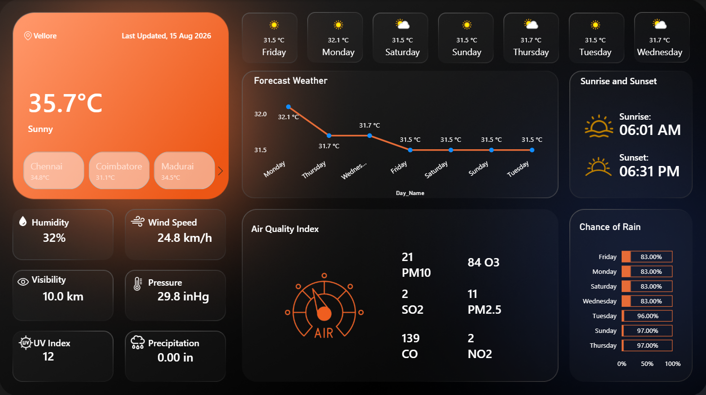

# Weather Analytics Dashboard

An interactive weather analytics dashboard built with Power BI to visualize current weather conditions, forecasts, air quality, and other environmental information in a single view.

The project focuses on transforming weather API data into an interactive dashboard using Power Query, DAX, data modeling, and Power BI visualizations.

## Dashboard Preview



## Features

- Current temperature and weather condition
- Location and last updated information
- Multi-day temperature forecast
- Chance of rain analysis
- Sunrise and sunset timings
- Humidity
- Wind speed
- Visibility
- Atmospheric pressure
- UV index
- Precipitation
- Air quality analysis

## Air Quality Analysis

The dashboard provides information for:

- PM10
- PM2.5
- CO
- NO2
- SO2
- O3

## Technologies Used

- Power BI
- Power Query
- DAX
- Weather API
- Data Modeling
- Data Visualization

## Data Source

Weather data is collected through a weather API and transformed before being used in Power BI.

The project uses current weather, forecast, and air quality data to create an interactive dashboard.

## Data Processing

Power Query was used to prepare and transform the API data before loading it into the Power BI data model.

The dashboard uses custom DAX measures to format and display weather and environmental metrics.

## Project Workflow

```text
Weather API
     |
     v
Data Collection
     |
     v
Power Query
     |
     v
Data Transformation
     |
     v
Data Modeling
     |
     v
DAX Measures
     |
     v
Power BI Dashboard
